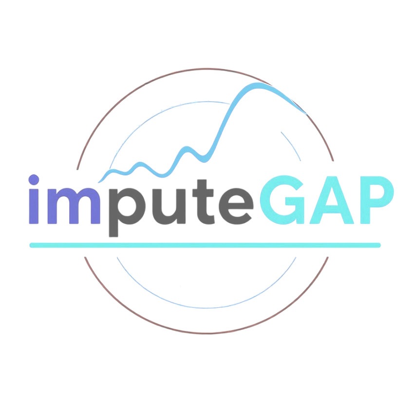

# Welcome to ImputeGAP
ImputeGAP is a unified framework for imputation algorithms that provides a narrow-waist interface between algorithm evaluation and parameterization for datasets issued from various domains ranging from neuroscience, medicine, climate to energy.

The interface provides advanced imputation algorithms, construction of various missing values patterns, and different evaluation metrics. In addition, the framework offers support for AutoML parameterization techniques, feature extraction, and, potentially, analysis of feature impact using SHAP. The framework should allow a straightforward integration of new algorithms, datasets, and metrics.

<br /><hr /><br />

## Installation
To install in local ImputeGAP, download the package from GitHub and run the command : 

```pip install -e .``` 

<br /><hr /><br />

## Execution
To execute a code containing the library ImputeGAP, we strongly advise you to use a unix environment. For <b>Windows OS</b>, please use the <b>WSL</b> tool to compute your project.

WSL can be choosen on IDE on the interpreter settings.

<br /><hr /><br />

## Loading - Manager
The model of management is able to load any kind of time series datasets in text format that respect this condition :<br /><br />
<b>(Values,Series)</b> : *series are seperated by space et values by a carriage return \n.*

<br /><hr /><br />

## Contamination
ImputeGAP allows to contaminate datasets with a specific scenario to reproduce a situation. Up to now, the scenarios are : <b>MCAR, MISSING POURCENTAGE, ...</b><br />
Please find the documentation in this page : <a href="https://github.com/eXascaleInfolab/ImputeGAP/tree/main/imputegap/contamination#readme" >missing data scenarios</a>

<br /><hr /><br />
