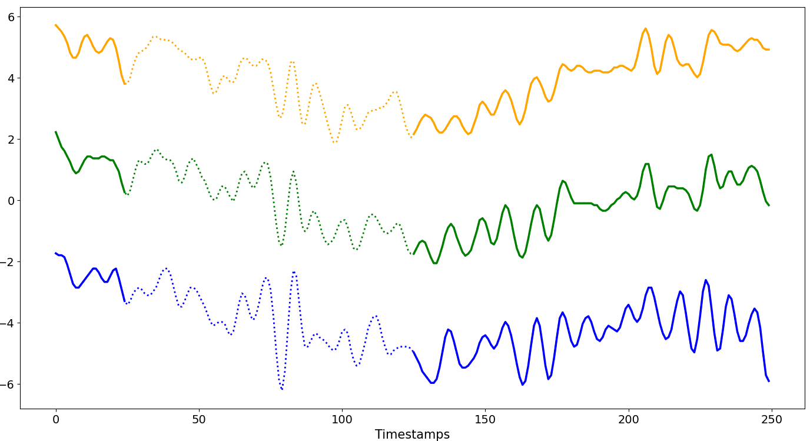
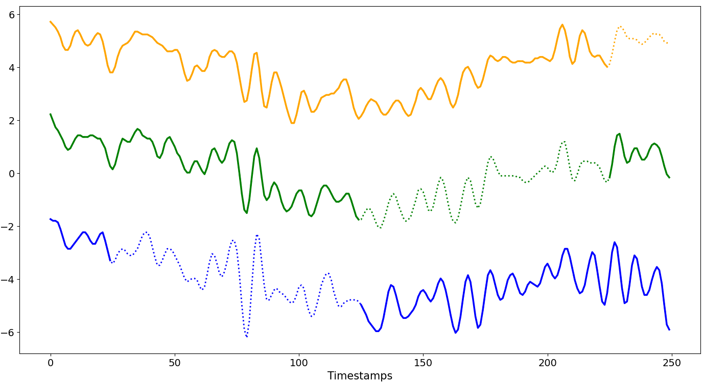
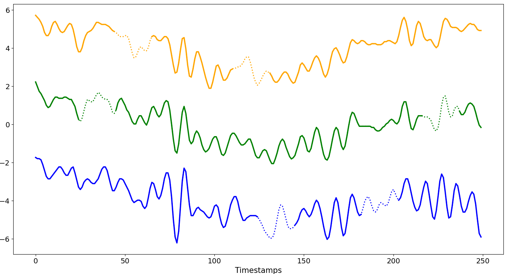
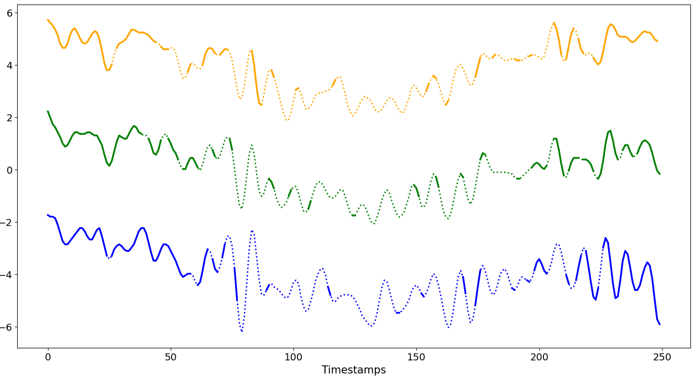

====================
Missingness Patterns
====================

ImputeGAP introduces a new taxonomy of missingness patterns tailored to time series, going beyond the traditional MAR and MNAR categories, which were not designed for temporal data.

.. _setup:

Setup
-----

.. note::

    -   M : number of time series
    -   N : length of time series
    -   W : user-defined offset window in the beginning of the series; default = 20
    -   R : user-defined rate of missing values (%); default = 20%
    -   S : user-defined rate of contaminated series (%); default = 20%

.. raw:: html

    

.. _scenario_mono_block:

MONO-BLOCK
----------
One missing block per series

.. raw:: html

    

**Aligned**

Missing blocks start and end at the same selected positions across the chosen series, resulting in aligned missing intervals.

.. note::

    -   ``R ∈ [1%, (100-W)%]``
    -   The size of a single missing block varies between 1% and (100 - ``W``)% of ``N``.
    -   The starting position is the same and begins at ``W`` and progresses until the size of the missing block is reached, affecting the first series from the top up to ``S%`` of the dataset.
    -   Cde: ``GenGap.aligned(ts.data, rate_dataset=1, rate_series=0.4, offset=25)``

.. raw:: html

    

.. raw:: html

     

**Disjoint**

Each missing block begins where the previous one ends, so the missing intervals are consecutive and do not overlap.

.. note::

    -   ``R ∈ [1%, (100-W)%]``
    -   The size of a single missing block varies between 1% and (100 - ``W``)% of ``N``.
    -   The starting position of the first missing block begins at ``W``.
    -   Each subsequent missing block starts immediately after the previous one ends, continuing this pattern until the limit of the dataset or ``N`` is reached.
    -   Code: ``GenGap.disjoint(ts.data, rate_series=0.4, offset=25)``

.. raw:: html

    

.. raw:: html

     

**Overlap**

Each missing block starts at the end of the previous one with a specified shift, so the missing intervals are consecutive and overlap.

.. note::

    -   ``R ∈ [1%, (100-W)%]``
    -   The size of a single missing block varies between 1% and (100 - ``W``)% of ``N``.
    -   The starting position of the first missing block begins at ``W``.
    -   Each subsequent missing block starts after the previous one ends, but with a shift back of ``X%``, creating an overlap.
    -   This pattern continues until the limit or ``N`` is reached.
    -   Code: ``GenGap.overlap(ts.data, rate_series=0.4, offset=25, shift=0.1)``

.. raw:: html

    

.. image:: _img/imputegap_overlap.png
   :alt: ImputeGAP Overlap Pattern
   :align: left
   :class: portrait

.. raw:: html

     

**Scattered**

The missing blocks all have the same size, but their starting positions are chosen at random.

.. note::

    -   ``R ∈ [1%, (100-W)%]``
    -   The size of a single missing block varies between 1% and (100 - ``W``)% of ``N``.
    -   The starting position is randomly shifted by adding a random value to ``W``, then progresses until the size of the missing block is reached, affecting the first series from the top up to ``S%`` of the dataset.
    -   Code: ``GenGap.scattered(ts.data, rate_dataset=1, rate_series=0.4, offset=25)``

.. raw:: html

    

.. image:: _img/imputegap_scattered.png
   :alt: ImputeGAP Scatter Pattern
   :align: left
   :class: portrait

.. raw:: html

     

.. _scenario_multi_block:

MULTI-BLOCK
-----------

Multiple missing blocks per series

.. raw:: html

    

**MCAR**

Missing blocks are introduced completely at random. Time series are selected at random, and blocks of a fixed size are removed at randomly chosen positions.

.. note::

    -   ``R ∈ [1%, (100-W)%]``
    -   Data blocks of the same size are removed from arbitrary series at a random position between ``W`` and ``N``, until the total number of missing values per series is reached.
    -   Code: ``GenGap.mcar(ts.data, rate_dataset=1, rate_series=0.2, offset=25, seed=False, block_size=20)``

.. raw:: html

    

.. raw:: html

     

**Block Distribution**

Missingness follows a probability distribution, each position has a certain chance of being missing.

.. note::

    -   ``R ∈ [1%, (100-W)%]``
    -   Data is removed following a distribution given by the user for every values of the series, affecting the first series from the top up to ``S%`` of the dataset.
    -   Code: ``GenGap.gaussian(ts.data, rate_dataset=1, rate_series=0.4, offset=25, selected_mean="position", std_dev=0.2)``

To configure the block distribution pattern, please refer to this `page <tutorials_distribution.html>`_.

.. raw:: html

    

.. raw:: html

     